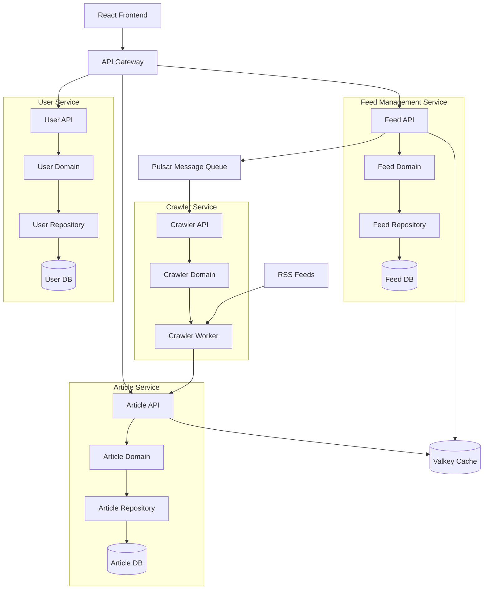

# Design Document

## Overview

Yomi is an RSS Reader application that will be built as a web-based application using modern web technologies. The system will consist of a frontend user interface for feed management and article reading, a backend service for RSS feed processing, and a data layer for persistent storage of feeds and articles.

## Architecture

Yomi follows a microservice architecture with Domain-Driven Design and Clean Architecture principles:



### Technology Stack
- **Frontend**: React with TypeScript
- **Build Tool**: Vite
- **Routing**: Tanstack React Router
- **State Management**: Zustand
- **Data Fetching**: TanStack Query (React Query)
- **UI Framework**: Tailwind CSS with Shadcn/ui components
- **Backend**: Hono (Node.js framework)
- **Database**: PostgreSQL with Drizzle ORM
- **Caching**: Valkey (Redis-compatible)
- **Message Queue**: Apache Pulsar
- **API**: gRPC for service communication
- **Web Scraping**: Crawlee for RSS feed fetching
- **Monorepo**: Turborepo for project management
- **Code Quality**: Biome for linting and formatting
- **Testing**: Vitest for unit tests, Playwright for E2E
- **Deployment**: Railway
- **Authentication**: Auth.js
- **Validation**: Zod for schema validation
- **Type Utilities**: type-fest for advanced TypeScript types

## Microservices and Domain Architecture

### Domain Boundaries
Following DDD principles, Yomi is organized into bounded contexts:

1. **Feed Management Context**: Handles RSS feed subscriptions and management
2. **Article Context**: Manages article content, reading status, and organization  
3. **Crawler Context**: Responsible for RSS feed discovery and content extraction
4. **User Context**: Manages user authentication, preferences, and subscriptions

### Clean Architecture Layers
Each microservice follows Clean Architecture with these layers:

- **Presentation Layer**: gRPC/HTTP API controllers
- **Application Layer**: Use cases and application services
- **Domain Layer**: Entities, value objects, and domain services
- **Infrastructure Layer**: Repositories, external services, and data access

## Components and Interfaces

### 1. Feed Manager Component
Responsible for RSS feed subscription management.

**Interface:**
```javascript
class FeedManager {
  addFeed(url: string): Promise<Feed>
  removeFeed(feedId: string): Promise<void>
  getAllFeeds(): Feed[]
  validateFeedUrl(url: string): Promise<boolean>
}
```

### 2. RSS Parser Component
Handles RSS/Atom feed parsing and normalization.

**Interface:**
```javascript
class RSSParser {
  parseFeed(xmlContent: string): ParsedFeed
  validateRSSFormat(xmlContent: string): boolean
  extractArticles(feedData: ParsedFeed): Article[]
}
```

### 3. Article Manager Component
Manages article data and read/unread status.

**Interface:**
```javascript
class ArticleManager {
  getArticlesByFeed(feedId: string): Article[]
  markAsRead(articleId: string): void
  markAsUnread(articleId: string): void
  getUnreadCount(feedId: string): number
}
```

### 4. Feed Updater Component
Handles automatic feed updates and synchronization.

**Interface:**
```javascript
class FeedUpdater {
  updateAllFeeds(): Promise<void>
  updateFeed(feedId: string): Promise<void>
  scheduleUpdates(): void
}
```

### 5. UI Components

#### Feed List Component
- Displays subscribed feeds
- Shows unread article counts
- Provides feed management actions

#### Article List Component
- Shows articles from selected feed
- Displays article metadata (title, date, summary)
- Indicates read/unread status

#### Article Reader Component
- Renders article content
- Handles read status updates
- Provides navigation between articles

#### Add Feed Component
- Feed URL input form
- Validation feedback
- Success/error messaging

## Data Models

### Feed Model
```javascript
interface Feed {
  id: string
  title: string
  url: string
  description?: string
  lastUpdated: Date
  isActive: boolean
}
```

### Article Model
```javascript
interface Article {
  id: string
  feedId: string
  title: string
  content: string
  summary?: string
  author?: string
  publishedDate: Date
  link: string
  isRead: boolean
}
```

### ParsedFeed Model
```javascript
interface ParsedFeed {
  title: string
  description: string
  link: string
  items: ParsedArticle[]
}

interface ParsedArticle {
  title: string
  content: string
  summary?: string
  author?: string
  publishedDate: string
  link: string
  guid?: string
}
```

## Error Handling

### Feed Validation Errors
- Invalid URL format
- Unreachable feed URL
- Invalid RSS/Atom format
- Network connectivity issues

**Strategy**: Display user-friendly error messages and provide suggestions for resolution.

### Feed Update Errors
- Network timeouts
- Server errors (4xx, 5xx)
- Malformed RSS content
- CORS restrictions

**Strategy**: Log errors, continue with other feeds, and provide retry mechanisms.

### Storage Errors
- LocalStorage quota exceeded
- Data corruption
- Browser compatibility issues

**Strategy**: Implement graceful degradation and data recovery mechanisms.

## Testing Strategy

### Unit Testing
- RSS parser functionality
- Feed validation logic
- Article management operations
- Data model transformations

### Integration Testing
- Feed addition workflow
- Article reading workflow
- Feed update process
- Error handling scenarios

### End-to-End Testing
- Complete user workflows
- Cross-browser compatibility
- Performance under load
- Offline functionality

### Test Data
- Sample RSS feeds for testing
- Mock network responses
- Edge case scenarios (empty feeds, malformed XML)

## Performance Considerations

### Feed Updates
- Implement incremental updates to avoid re-parsing unchanged content
- Use conditional requests (If-Modified-Since headers) when possible
- Batch feed updates to reduce network overhead

### Data Storage
- Implement data cleanup for old articles
- Compress stored data when possible
- Lazy load article content

### UI Responsiveness
- Virtual scrolling for large article lists
- Progressive loading of feed content
- Debounced search and filtering

## Security Considerations

### Content Security
- Sanitize HTML content from RSS feeds
- Prevent XSS attacks through article content
- Validate and escape user inputs

### Network Security
- Handle CORS restrictions appropriately
- Implement proper error handling for network requests
- Consider using a proxy service for feed fetching if needed

## Accessibility

- Keyboard navigation support
- Screen reader compatibility
- High contrast mode support
- Proper ARIA labels and roles
- Focus management for dynamic content